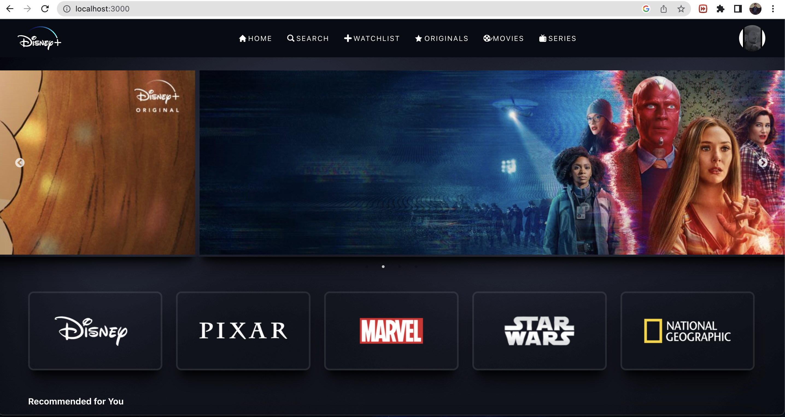

# Disney+ Hotstar Front-end Clone

Welcome to this repository containing a front-end clone of the Disney+ Hotstar website, built using HTML, CSS, JavaScript and ReactJs.

Please note that this website is for educational purposes only and is intended to be used as a portfolio piece. It is not intended for commercial or monetary gain and is not affiliated with Disney and Hotstar.

# Installation

1. Clone the repository
2. Navigate to the folder in VS code 
3. Run npm start 🎬
4. Ready to launch 🚀!

# Link
https://disney-plus-unofficial.web.app/

# Libraries/Technologies used

# Screenshots

